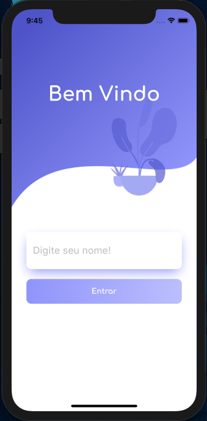
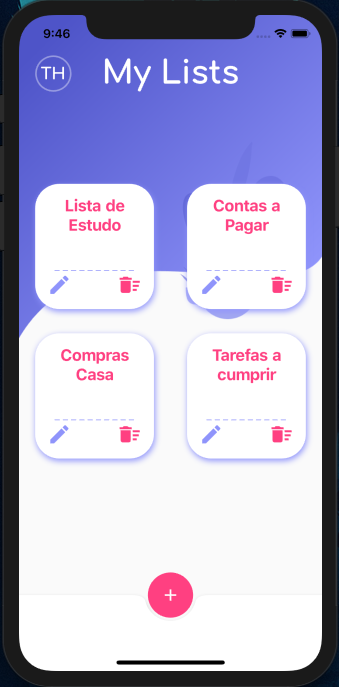
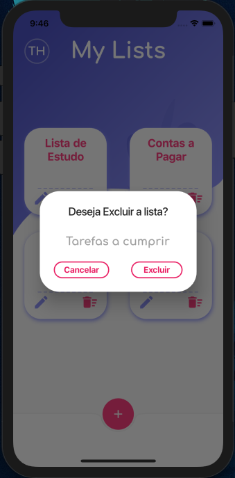
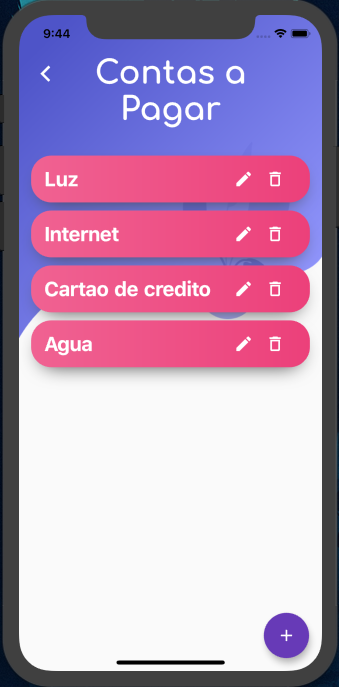

# todo_list_flutter

 Todo List desenvolvido em Flutter.
 

  
 
 
 
 
 

   
 
 

# O App aborda:

UI Design

    • Containers decorations(Gradient colors, BoxShadow...)
  
    • ListView.
  
    • GridView.
  
    • AlertDialog Customizado.
  
                        
Manipulação de dados:.

    • Shared preferences.
  
    • SqFlite.
  
  
Animations.

    • FadeIn Animation.
 

 

 
